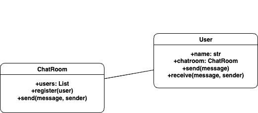

# Chat Grupal – Patrón Mediator

## 📚 Descripción General

Este mini-proyecto implementa una aplicación de chat grupal usando el **Patrón Mediator**, cumpliendo con el ejercicio 3 de la guía de actividad.  
El objetivo es demostrar cómo aplicar buenas prácticas de arquitectura orientada a objetos para lograr un sistema flexible, escalable y fácil de mantener.

---

## 🏛️ Arquitectura y Patrón de Diseño

- **Tipo de patrón:** Comportamiento
- **Patrón seleccionado:** **Mediator**
- **Justificación profesional:**  
  El patrón Mediator centraliza la comunicación entre objetos (usuarios), delegando la coordinación a un componente mediador (la clase `ChatRoom`).  
  Este enfoque elimina las referencias directas entre usuarios, lo que reduce el acoplamiento y favorece la escalabilidad y el mantenimiento.  
  Cuando se agrega o elimina un usuario, no es necesario modificar otros objetos, cumpliendo con principios SOLID como Open/Closed y Single Responsibility.

---

## 💡 Beneficios de aplicar el Patrón Mediator

- **Bajo acoplamiento:** Cada usuario sólo depende del mediador, no de los demás usuarios.
- **Alta cohesión:** La lógica de interacción está centralizada en `ChatRoom`, evitando dispersión de responsabilidades.
- **Escalabilidad:** Se pueden agregar funcionalidades, usuarios o nuevas reglas de negocio de manera sencilla y sin impacto en el resto del sistema.
- **Testabilidad:** Al estar la lógica centralizada, es más fácil escribir pruebas unitarias y validar la funcionalidad.
- **Mantenibilidad:** Los cambios futuros son localizados y seguros; la arquitectura soporta cambios evolutivos sin deuda técnica.

---

## 🛠️ Buenas prácticas aplicadas

- **Estructura modular:** Código distribuido en paquetes (`models/`) para separación de responsabilidades.
- **Tipado explícito:** Uso de anotaciones de tipo (`typing`) para mayor claridad y robustez.
- **Docstrings:** Documentación en clases y métodos para facilitar el entendimiento y onboarding de otros desarrolladores.
- **Convención de nombres:** Uso de nombres claros y en inglés, alineados a estándares de la industria.
- **Archivos auxiliares:** Diagrama UML exportado como imagen y fuente editable para facilitar documentación viva y colaboración.

---

## 📝 Diagrama de Clases

El diseño sigue UML, orientado a objetos y fiel a la implementación real:




---

## 🗂️ Estructura del Proyecto

```text
chat_mediator/
├── assets/
│   └── diagram.png
├── models/
│   ├── __init__.py
│   ├── chatroom.py
│   └── user.py
├── tests/
│   └── test_chat.py
├── main.py
└── README.md
```

---

## 🚀 Cómo ejecutar el proyecto

1. Instala Python 3.8+ si no lo tienes.
2. Clona el repositorio o descarga el código.
3. Desde la raíz del proyecto, ejecuta:

```bash
python main.py
```

4. Desde la raíz del proyecto, ejecuta Coverage:

```bash
coverage run -m pytest coverage report
```

5. Desde la raíz del proyecto, Ver el reporte del Coverage desde la consola:

```bash
coverage report
```
