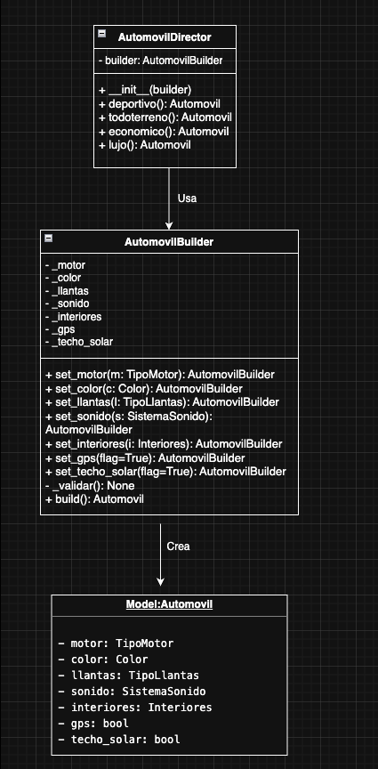
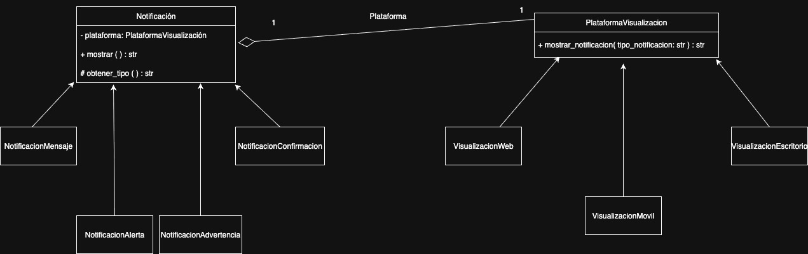
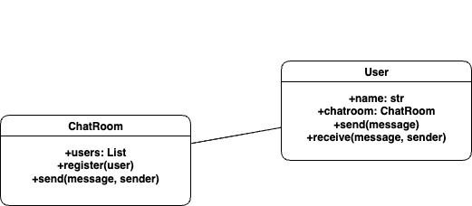

# Patrones de arquitectura

## Proyecto general

### 🗂️ Estructura del Proyecto

```text
├── README.md
├── assets
│   ├── UML_2.jpg
│   └── UML_3.png
├── exerciseOne
│   ├── main.py
│   └── models
│       └── __init__.py
├── exerciseThree
│   ├── main.py
│   └── models
│       ├── __init__.py
│       ├── chatroom.py
│       └── user.py
└── exerciseTwo
    ├── main.py
    └── models
        ├── __init__.py
        ├── notificacion.py
        └── plataforma.py

9 directories, 15 files
```

---

### 🚀 Cómo ejecutar el proyecto

1. Instala Python 3.8+ si no lo tienes.
2. Clona el repositorio o descarga el código.
3. Navega a la carpeta del ejercicio deseado y ejecuta su `main.py`

## Ejercicio1 – (Patrón Builder)

### 📚 Descripción General

Este ejercicio implementa el **patrón de diseño Builder** aplicado al dominio de automóviles.  
El objetivo es construir objetos complejos (Automóviles) paso a paso, separando la representación final del proceso de construcción.

---

### 🏛️ Arquitectura y Patrón de Diseño

- **Tipo de patrón:** Creacional  
- **Patrón seleccionado:** **Builder**  
- **Justificación profesional:**  
  El patrón Builder fue elegido porque quita la responsabilidad del constructor para crear el objeto ademas de facilitar la comprension cognitiva de este proceso. Ademas, independiza cada propiedad y hace que se pueda trabajar el modelo desde diferentes lugares.

---

### 💡 Beneficios de aplicar el Patrón Builder

- Permite construir objetos paso a paso.  
- Flexibilidad para generar distintas variantes de un mismo producto.  
- reduccion de complegidad cognitiva.  
- Centralización de validaciones en el proceso de construcción.  
- Separación de responsabilidades entre el modelo y el constructor.  

---

### 🛠️ Buenas prácticas aplicadas

- Uso de `@dataclass` para simplificar la definición del modelo.  
- Organización modular del proyecto (`domain`, `builders`, `directors`, `exceptions`).  
- Encapsulación de atributos internos en el Builder.  
- Uso de una excepción dedicada para configuraciones inválidas.  
- Aplicación del principio de responsabilidad única.
- Uso de Enums para tipado de datos  


---

### 📝 Diagrama de Clases

AutomovilDirector utiliza un builder para orquestar la construccion de automoviles y el builder construye el producto final.




---

## Ejercicio2 – Patrón Bridge

### 📚 Descripción General

Este mini-proyecto implementa una aplicación que gestiona la visualización de notificaciones en diferentes plataformas (escritorio, móvil, web) usando el **Patrón Bridge**. El objetivo es demostrar cómo aplicar buenas prácticas de arquitectura orientada a objetos para lograr un sistema flexible, escalable y fácil de mantener, permitiendo que los tipos de notificación (mensaje, alerta, advertencia, confirmación) y las plataformas de visualización varíen independientemente.

---

### 🏛️ Arquitectura y Patrón de Diseño

- **Tipo de patrón:** Estructural
- **Patrón seleccionado:** **Bridge**
- **Justificación profesional:**  
  El patrón Bridge separa la abstracción (tipos de notificación) de la implementación (plataformas de visualización), permitiendo que ambas varíen independientemente. Este enfoque reduce el acoplamiento entre clases, facilitando la extensión del sistema sin modificar código existente. Por ejemplo, se pueden agregar nuevas plataformas (como TV o consola) o tipos de notificación sin afectar las implementaciones actuales.

---

### 💡 Beneficios de aplicar el Patrón Bridge

 - Puedes crear clases y aplicaciones independientes de plataforma.
 El código cliente funciona con abstracciones de alto nivel. No está expuesto a los detalles de la plataforma.
 Principio de abierto/cerrado. Puedes introducir nuevas abstracciones e implementaciones independientes entre sí.
 Principio de responsabilidad única. Puedes centrarte en la lógica de alto nivel en la abstracción y en detalles de la plataforma en la implementación.

---

### 🛠️ Buenas prácticas aplicadas

- SOLID: SRP y OCP (nuevas plataformas/tipos sin modificar código existente).
- Clases abstractas (ABC) y métodos abstractos: evitan instancias incorrectas.
- Anotaciones de tipo y docstrings para claridad y mantenibilidad.
- Nombres de funciones claros.

---

### 📝 Diagrama de Clases

Diseño UML basado en el patron Bridge:



---

## Ejercicio3 – Patrón Mediator

### 📚 Descripción General

Este mini-proyecto implementa una aplicación de chat grupal usando el **Patrón Mediator**, cumpliendo con el ejercicio 3 de la guía de actividad.  
El objetivo es demostrar cómo aplicar buenas prácticas de arquitectura orientada a objetos para lograr un sistema flexible, escalable y fácil de mantener.

---

### 🏛️ Arquitectura y Patrón de Diseño

- **Tipo de patrón:** Comportamiento
- **Patrón seleccionado:** **Mediator**
- **Justificación profesional:**  
  El patrón Mediator centraliza la comunicación entre objetos (usuarios), delegando la coordinación a un componente mediador (la clase `ChatRoom`).  
  Este enfoque elimina las referencias directas entre usuarios, lo que reduce el acoplamiento y favorece la escalabilidad y el mantenimiento.  
  Cuando se agrega o elimina un usuario, no es necesario modificar otros objetos, cumpliendo con principios SOLID como Open/Closed y Single Responsibility.

---

### 💡 Beneficios de aplicar el Patrón Mediator

- **Bajo acoplamiento:** Cada usuario sólo depende del mediador, no de los demás usuarios.
- **Alta cohesión:** La lógica de interacción está centralizada en `ChatRoom`, evitando dispersión de responsabilidades.
- **Escalabilidad:** Se pueden agregar funcionalidades, usuarios o nuevas reglas de negocio de manera sencilla y sin impacto en el resto del sistema.
- **Testabilidad:** Al estar la lógica centralizada, es más fácil escribir pruebas unitarias y validar la funcionalidad.
- **Mantenibilidad:** Los cambios futuros son localizados y seguros; la arquitectura soporta cambios evolutivos sin deuda técnica.

---

### 🛠️ Buenas prácticas aplicadas

- **Estructura modular:** Código distribuido en paquetes (`models/`) para separación de responsabilidades.
- **Tipado explícito:** Uso de anotaciones de tipo (`typing`) para mayor claridad y robustez.
- **Docstrings:** Documentación en clases y métodos para facilitar el entendimiento y onboarding de otros desarrolladores.
- **Convención de nombres:** Uso de nombres claros y en inglés, alineados a estándares de la industria.
- **Archivos auxiliares:** Diagrama UML exportado como imagen y fuente editable para facilitar documentación viva y colaboración.

---

## 📝 Diagrama de Clases

El diseño sigue UML, orientado a objetos y fiel a la implementación real:



---
